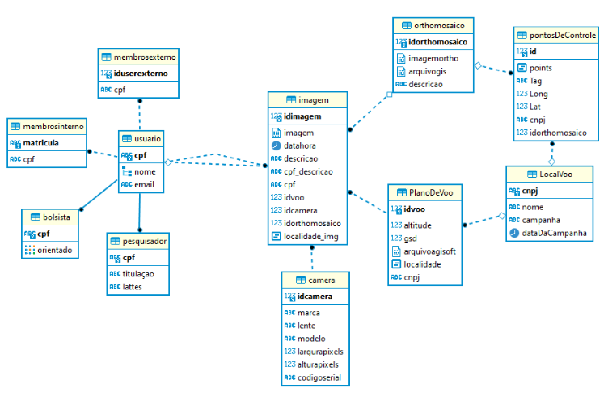

# Non-Conventional-Databases-2023

Repositório referente a materia de banco de dados não convencionais na Ufscar

## Resumo

Apresentar conceitos, técnicas e ferramentas relevantes na área de banco de dados não-convencionais. Serão analisados os modelos de dados para aplicações não-convencionais e serão estudadas as principais características dos sistemas gerenciadores de banco de dados para apoiar o desenvolvimento de tais aplicações.

## Arquivos relacionados

Script para a criação do banco [Script.sql](./Script.sql)

Código em python de uma interface basica no terminal [main.py](./main.py)

## Esquema fisico:

